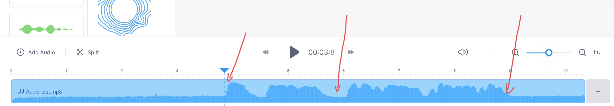

# nce-audio-editor

这个repo为英语学习者提供了一个简洁的audio editor。


## Introduction

近期我被安利了一个很有效的英语背诵方法。它的要点如下：

1. 选择好的背诵材料（比如新概念英语），找到材料的录音原文；
1. 将录音按句子去分割，每一个句子作为一个unit；
1. 在开车的时候来按unit背诵。对于每一个unit，先播放录音，然后留白一段时间，如此repeat。

实践之后发现效果很好。

唯一的问题是，使用剪辑软件太过麻烦，学习成本高。

本repo提供了一个tool来方便地生成我们想要的播放列表。

输入：一个mp3文件；每个分割点的timestamp

输出：若干个mp3文件，每一个都包含了若干（默认值10）个cycle，每个cycle包含了一段录音和一段时间（默认是：2.5倍的该段录音时间）留白。


## Instruction

1. 找到材料的录音原文（mp3格式）。将`main.py`里的`INPUT_PATH`变量改成这个录音文件的路径。

1. 找到每一句话的分割点。

	这里我使用了[https://www.veed.io](https://www.veed.io)这个网站，将录音原文import进去后，我们可以看到声音的波形图，这样就可以很容易地找到每一句话的分割点。

	以我们的demo为例子，通过听声音和看波形图，很容易得出三个分割点`[3.8, 5.9, 9.1]`，其中3.8s到5.9s是第一句话，5.9s到9.1s是第二句话。

	

1. 将`main.py`的`TIMES`变量改成分割点列表（type是`List[float]`）。

1. `python main.py`

1. 可以在`output`这个文件夹里看到生成的文件列表。


## 注意事项

1. 运行前需要安装moviepy package，`pip install moviepy`。
1. `input`文件夹里有一个`silence_one_minute.mp3`，这个不要删掉了。我们生成的音频里的留白部分是从这个文件里抽取的。

	如果你想要自己生成这个文件的话，可以运行下面这个python代码。

	（运行前需要`brew install ffmpeg`和`pip install pydub`）

	```python
	from pydub import AudioSegment
	
	silence = AudioSegment.silent(duration=60 * 1000)
	silence.export("silence.mp3", format="mp3")
	```

